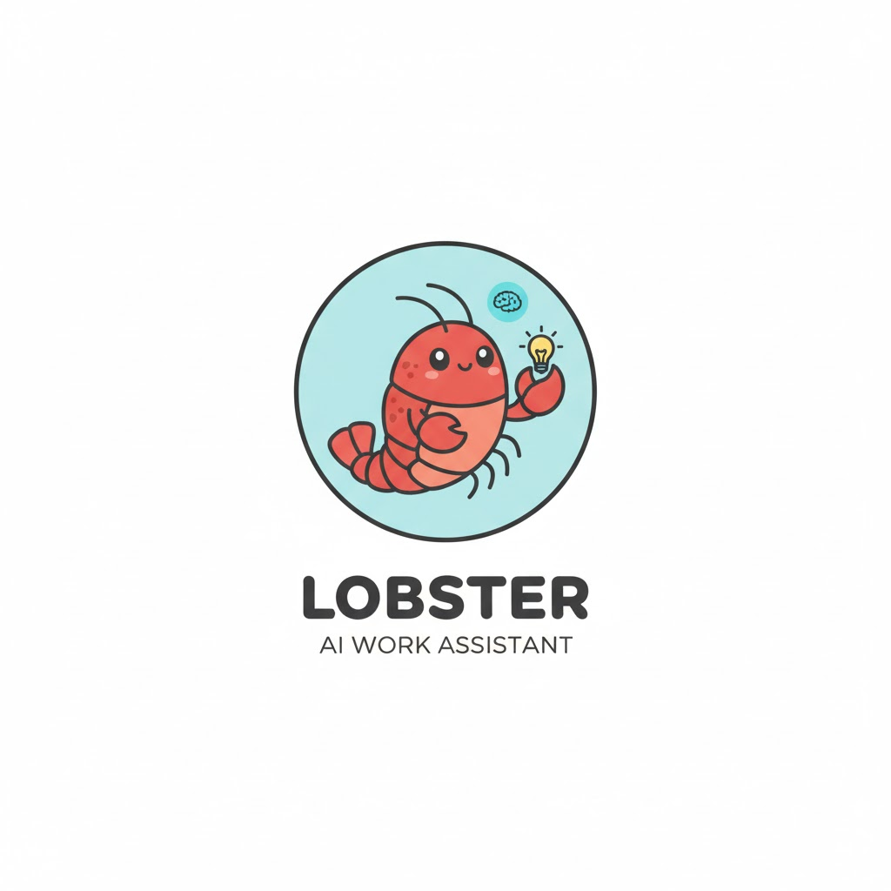

# Lobster — Personal AI Assistant



A macOS daemon that runs a personal AI assistant over Telegram, powered by Claude. It manages your todos, work log, calendar, and long-term memory.

---

## Prerequisites

- macOS (uses launchd + AppleScript for calendar)
- Python 3.11+
- [icalBuddy](https://hasseg.org/icalBuddy/) for calendar: `brew install ical-buddy`
- A [Telegram bot token](https://t.me/BotFather) — send `/newbot` to @BotFather
- An [Anthropic API key](https://console.anthropic.com/)

---

## Setup

### 1. Clone the repo

```bash
git clone <repo-url> ~/Documents/lobster
cd ~/Documents/lobster
```

### 2. Add your secrets

Create a `.env` file in the project root (never committed to git):

```bash
cp .env.example .env   # if provided, or create from scratch
```

`.env` should contain:

```
ANTHROPIC_API_KEY=sk-ant-...
TELEGRAM_BOT_TOKEN=123456789:AAG...
```

### 3. Create `config.yaml`

```bash
cp config.example.yaml config.yaml
```

`config.yaml` is gitignored — your local settings (including `telegram_chat_id`) will never be committed. Non-secret settings you can adjust:

| Key | Default | Description |
|---|---|---|
| `brain_path` | `~/lobster-brain` | Where brain files are stored |
| `morning_briefing_time` | `09:00` | Daily briefing time (24h, local) |
| `evening_checkin_time` | `17:30` | Evening check-in time (24h, local) |
| `model` | `claude-sonnet-4-6` | Claude model to use |
| `max_tokens` | `4096` | Max tokens per response |
| `weekly_snippet_day` | _(disabled)_ | Day of week to auto-send weekly snippet (e.g. `friday`) |
| `weekly_snippet_time` | _(disabled)_ | Time to auto-send weekly snippet (24h, e.g. `17:00`) |

`telegram_chat_id` is set automatically on first `/start` — you don't need to fill it in.

### 4. Run setup

```bash
bash setup.sh
```

This will:
- Create `~/lobster-brain/` and seed initial files
- Create a Python venv at `.venv/` and install dependencies
- Install and load the launchd daemon (`com.lobster.assistant.plist`)

### 5. Start the bot

Open Telegram and send `/start` to your bot. Lobster will walk you through a short onboarding to personalise your assistant.

---

## Commands

| Command | Description |
|---|---|
| `/start` | Onboarding (first run) or greeting |
| `/todos` | Show current todo list |
| `/log` | Show today's work log |
| `/weekly` | Generate a Confluence-ready weekly update (interactive Q&A then full draft) |
| `/perfreview` | Generate a self-performance review (2-question Q&A then full review) |
| `/clear` | Clear conversation history |
| `/help` | Show help message |

Everything else is free-text — just talk to Lobster in plain English.

---

## Reminders

Lobster supports natural-language reminders — both one-off and recurring.

**One-off reminders** — just ask in plain English:
- "Remind me to review the PR in 30 minutes"
- "Remind me tomorrow at 9am to prep for standup"

**Recurring reminders** — Lobster will set up a repeating schedule:
- "Remind me every Monday at 10am to send the team update"
- "Remind me every day at 6pm to log my work"

Recurring reminders persist across daemon restarts — they are saved in `~/lobster-brain/recurring_reminders.json` and reloaded automatically when Lobster starts.

To cancel a reminder, just ask: "Cancel my standup reminder."

---

## Managing the daemon

```bash
# Check status
launchctl list | grep lobster

# View logs
tail -f ~/lobster-brain/lobster.log

# Stop daemon
launchctl unload ~/Library/LaunchAgents/com.lobster.assistant.plist

# Start daemon
launchctl load ~/Library/LaunchAgents/com.lobster.assistant.plist

# Run manually (foreground, useful for debugging)
.venv/bin/python main.py
```

---

## Project structure

```
lobster/
├── main.py                  # Asyncio entrypoint
├── agent.py                 # Anthropic tool-use loop
├── config.py                # Loads .env + config.yaml
├── scheduler.py             # Morning briefing & evening check-in
├── config.example.yaml      # Settings template (committed)
├── config.yaml              # Your local settings (gitignored)
├── .env                     # Secrets (not committed)
├── requirements.txt
├── setup.sh                 # One-time setup script
└── handlers/
    ├── telegram_handler.py  # Message routing & commands
    ├── onboarding.py        # First-run onboarding flow
    ├── file_manager.py      # Brain file read/write helpers
    ├── todo_manager.py      # Checkbox todo CRUD
    ├── calendar_reader.py   # AppleScript calendar access
    ├── perf_review.py       # Performance review generation
    ├── reminder_manager.py  # Reminder scheduling and persistence
    └── weekly_snippet.py    # Weekly Confluence snippet generation
```

Brain files live in `~/lobster-brain/`:

```
lobster-brain/
├── role.md       # Persona & instructions (written during onboarding)
├── memory.md     # Long-term facts
├── worklog.md    # Dated work log entries
├── todos.md      # Checkbox todo list
├── lobster.log               # Runtime log
├── .onboarded                # Marker — present after first-run onboarding
├── recurring_reminders.json  # Persisted recurring reminder definitions (created at runtime)
└── .scheduler_state.json     # APScheduler job state (created at runtime)
```

---

## Re-running onboarding

Delete the marker file and send `/start`:

```bash
rm ~/lobster-brain/.onboarded
```

---

## Development

### Running tests

```bash
.venv/bin/python -m pytest tests/
```

With coverage:

```bash
.venv/bin/python -m pytest tests/ --cov=. --cov-report=term-missing
```

### Test files

| File | Covers |
|---|---|
| `tests/test_file_manager.py` | Brain file read/write, worklog helpers, date-range queries |
| `tests/test_todo_manager.py` | Todo parse/render, CRUD operations, completed todo listing |
| `tests/test_system_prompt.py` | System prompt assembly, section ordering, edge cases |
| `tests/test_telegram_handler.py` | `_split_message` chunking logic |
| `tests/test_perf_review.py` | `_truncate_worklog` trimming logic |
| `tests/test_weekly_snippet.py` | `_week_range` date formatting |
| `tests/test_reminder_manager.py` | Reminder parsing, persistence, scheduling |
| `tests/test_calendar_reader.py` | Calendar AppleScript output parsing |
